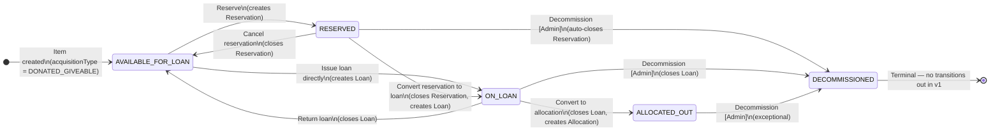
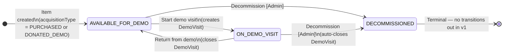
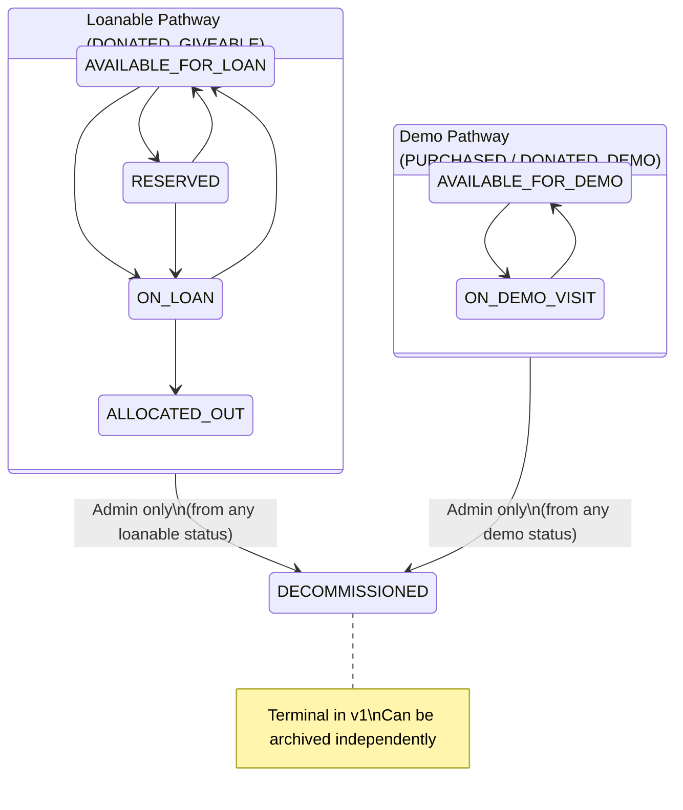

# State Machine Diagrams
## MyVision Equipment Tracker — Status Transitions

> Visual representation of the transition rules defined in [PRD v1.0 §4.5](../PRD.md). These diagrams are the canonical reference for status flow — if they conflict with prose elsewhere, these diagrams govern.

---

## Loanable Pathway (DONATED_GIVEABLE)

### Guards

| Transition | Guard |
|---|---|
| Any → RESERVED | acquisitionType must be DONATED_GIVEABLE |
| Any → ON_LOAN | acquisitionType must be DONATED_GIVEABLE |
| RESERVED → DECOMMISSIONED | Confirmation required — warns that active reservation will be auto-cancelled |
| ON_LOAN → DECOMMISSIONED | Confirmation required — loan closed with reason DECOMMISSIONED |
| ALLOCATED_OUT → DECOMMISSIONED | Admin only; exceptional use (item lost/destroyed after permanent allocation) |

---

## Demo Pathway (PURCHASED / DONATED_DEMO)

### Guards

| Transition | Guard |
|---|---|
| AVAILABLE_FOR_DEMO → ON_DEMO_VISIT | acquisitionType must be PURCHASED or DONATED_DEMO |
| ON_DEMO_VISIT → DECOMMISSIONED | Confirmation required — warns that active demo visit will be auto-closed |

---

## Combined Overview

---

## Archive Flag (Independent)

The archive flag is NOT a status — it is an independent boolean on the Equipment record. Any item in any status can be archived or unarchived by an Admin.

**Common archive patterns:**
- DECOMMISSIONED items archived to remove from active views
- ALLOCATED_OUT items archived once historical (client no longer active)
- Discontinued demo stock archived

**Not typically archived:** items in active operational statuses (AVAILABLE_FOR_LOAN, ON_LOAN, RESERVED, AVAILABLE_FOR_DEMO, ON_DEMO_VISIT).

---

## Side Effects per Transition

| Transition | Records Created/Closed | Audit Event |
|---|---|---|
| → RESERVED | Reservation created | `RESERVED` |
| RESERVED → ON_LOAN | Reservation closed (CONVERTED_TO_LOAN), Loan created | `RESERVATION_CANCELLED` + `LOAN_ISSUED` |
| RESERVED → AVAILABLE_FOR_LOAN | Reservation closed (CANCELLED) | `RESERVATION_CANCELLED` |
| → ON_LOAN (direct) | Loan created | `LOAN_ISSUED` |
| ON_LOAN → AVAILABLE_FOR_LOAN | Loan closed (RETURNED) | `LOAN_RETURNED` |
| ON_LOAN → ALLOCATED_OUT | Loan closed (CONVERTED_TO_ALLOCATION), Allocation created | `LOAN_CONVERTED_TO_ALLOCATION` |
| → ALLOCATED_OUT (direct) | Allocation created | `ALLOCATED_DIRECTLY` |
| → ON_DEMO_VISIT | DemoVisit created | `DEMO_VISIT_STARTED` |
| ON_DEMO_VISIT → AVAILABLE_FOR_DEMO | DemoVisit closed (RETURNED) | `DEMO_VISIT_RETURNED` |
| Any → DECOMMISSIONED | Active dependents auto-closed (if any) | `DECOMMISSIONED` |
| Archive toggled | — | `ARCHIVED` or `ARCHIVE_RESTORED` |

---

## Transition Validation Matrix

For use in `TransitionService.validate()`. Each cell shows whether the transition is valid (✓), invalid (✗), or conditional (⚠).

| From ↓ / To → | AVAIL_LOAN | RESERVED | ON_LOAN | ALLOC_OUT | AVAIL_DEMO | ON_DEMO | DECOM |
|---|---|---|---|---|---|---|---|
| AVAILABLE_FOR_LOAN | — | ✓ | ✓ | ✓ | ✗ | ✗ | ✓ Admin |
| RESERVED | ✓ | — | ✓ | ✗ | ✗ | ✗ | ⚠ Admin + warn |
| ON_LOAN | ✓ | ✗ | — | ✓ | ✗ | ✗ | ⚠ Admin + warn |
| ALLOCATED_OUT | ✗ | ✗ | ✗ | — | ✗ | ✗ | ✓ Admin |
| AVAILABLE_FOR_DEMO | ✗ | ✗ | ✗ | ✗ | — | ✓ | ✓ Admin |
| ON_DEMO_VISIT | ✗ | ✗ | ✗ | ✗ | ✓ | — | ⚠ Admin + warn |
| DECOMMISSIONED | ✗ | ✗ | ✗ | ✗ | ✗ | ✗ | — |
